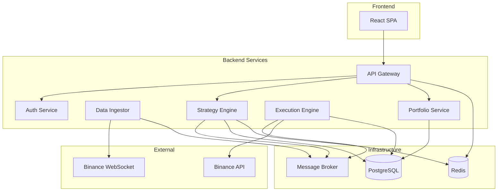
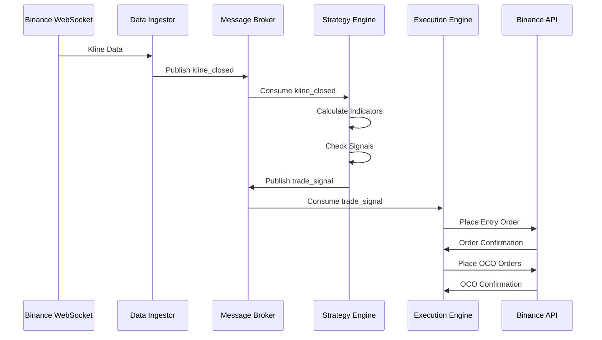

# Documento de Design - Sistema AURA

## Visão Geral

O Sistema AURA será implementado usando uma arquitetura orientada a eventos com microserviços, garantindo baixa latência, alta disponibilidade e escalabilidade. O sistema será composto por um frontend React, backend Node.js/TypeScript com múltiplos serviços especializados, banco de dados PostgreSQL e cache Redis.

## Arquitetura

### Arquitetura Geral



### Fluxo de Dados em Tempo Real



## Componentes e Interfaces

### 1. Frontend (React SPA)

**Tecnologias:** React 18, TypeScript, Redux Toolkit, Material-UI

**Componentes Principais:**
- `DashboardPage`: Visão geral do portfólio e performance
- `StrategiesPage`: Criação e gerenciamento de estratégias
- `HistoryPage`: Histórico de trades e análises
- `SettingsPage`: Configurações de API e preferências

**Estado Global (Redux):**
```typescript
interface RootState {
  auth: AuthState;
  portfolio: PortfolioState;
  strategies: StrategiesState;
  marketData: MarketDataState;
  ui: UIState;
}
```

### 2. API Gateway

**Responsabilidades:**
- Autenticação JWT
- Rate limiting
- Roteamento de requisições
- Validação de entrada
- Logging de requisições

**Endpoints Principais:**
```typescript
// Autenticação
POST /api/v1/auth/login
POST /api/v1/auth/register
POST /api/v1/auth/refresh

// Estratégias
GET /api/v1/strategies
POST /api/v1/strategies
PUT /api/v1/strategies/:id
DELETE /api/v1/strategies/:id
POST /api/v1/strategies/:id/activate
POST /api/v1/strategies/:id/deactivate
POST /api/v1/strategies/:id/backtest

// Portfólio
GET /api/v1/portfolio/overview
GET /api/v1/portfolio/positions
GET /api/v1/portfolio/history

// Configurações
POST /api/v1/settings/api-keys
GET /api/v1/settings/api-keys/status
```

### 3. Data Ingestor Service

**Responsabilidades:**
- Manter conexões WebSocket com Binance
- Processar dados de kline em tempo real
- Fornecer dados históricos
- Publicar eventos no message broker

**Interface:**
```typescript
interface DataIngestor {
  subscribeToSymbol(symbol: string, interval: string): void;
  unsubscribeFromSymbol(symbol: string, interval: string): void;
  getHistoricalData(symbol: string, interval: string, startTime: number, endTime: number): Promise<KlineData[]>;
}

interface KlineData {
  symbol: string;
  interval: string;
  openTime: number;
  closeTime: number;
  open: string;
  high: string;
  low: string;
  close: string;
  volume: string;
}
```

### 4. Strategy Engine Service

**Responsabilidades:**
- Executar lógica das estratégias ativas
- Calcular indicadores técnicos
- Detectar sinais de entrada/saída
- Gerenciar estado das estratégias

**Arquitetura de Estratégias:**
```typescript
abstract class BaseStrategy {
  protected indicators: Map<string, number[]> = new Map();
  protected params: StrategyParams;
  
  abstract onKline(kline: KlineData): Promise<void>;
  abstract checkEntrySignal(): boolean;
  abstract checkExitSignal(): boolean;
  
  protected updateIndicators(kline: KlineData): void;
  protected calculateSMA(period: number): number;
  protected calculateEMA(period: number): number;
  protected calculateRSI(period: number): number;
  protected calculateMACD(): { macd: number; signal: number; histogram: number };
}

interface StrategyParams {
  symbol: string;
  interval: string;
  entryConditions: Condition[];
  exitConditions: Condition[];
  riskParams: RiskParams;
}

interface RiskParams {
  positionSizeUsd: number;
  takeProfitPercent: number;
  stopLossPercent: number;
  maxDrawdownPercent: number;
}
```

### 5. Execution Engine Service

**Responsabilidades:**
- Executar ordens na Binance
- Gerenciar ordens OCO
- Validar saldo e regras
- Reconciliação de posições órfãs

**Interface:**
```typescript
interface ExecutionEngine {
  executeTradeSignal(signal: TradeSignal): Promise<TradeResult>;
  reconcileOrphanedPositions(): Promise<void>;
  cancelOrder(orderId: string): Promise<void>;
  getOpenPositions(): Promise<Position[]>;
}

interface TradeSignal {
  strategyId: string;
  symbol: string;
  action: 'ENTRY' | 'EXIT';
  signalPrice: string;
  riskParams: RiskParams;
}

interface TradeResult {
  success: boolean;
  entryOrderId?: string;
  ocoOrderId?: string;
  error?: string;
}
```

### 6. Portfolio Service

**Responsabilidades:**
- Calcular valor do portfólio
- Agregar P&L
- Fornecer métricas de performance
- Atualizar dados em tempo real

## Modelos de Dados

### Esquema do Banco de Dados

```sql
-- Usuários
CREATE TABLE users (
    id SERIAL PRIMARY KEY,
    username VARCHAR(50) UNIQUE NOT NULL,
    email VARCHAR(100) UNIQUE NOT NULL,
    password_hash VARCHAR(255) NOT NULL,
    created_at TIMESTAMPTZ DEFAULT NOW(),
    updated_at TIMESTAMPTZ DEFAULT NOW()
);

-- Chaves de API criptografadas
CREATE TABLE user_api_keys (
    id SERIAL PRIMARY KEY,
    user_id INTEGER REFERENCES users(id) ON DELETE CASCADE,
    binance_api_key VARCHAR(255) NOT NULL,
    binance_secret_key_encrypted TEXT NOT NULL,
    is_active BOOLEAN DEFAULT TRUE,
    created_at TIMESTAMPTZ DEFAULT NOW()
);

-- Estratégias
CREATE TABLE strategies (
    id SERIAL PRIMARY KEY,
    user_id INTEGER REFERENCES users(id) ON DELETE CASCADE,
    name VARCHAR(100) NOT NULL,
    symbol VARCHAR(20) NOT NULL,
    interval VARCHAR(5) NOT NULL,
    entry_conditions JSONB NOT NULL,
    exit_conditions JSONB NOT NULL,
    risk_params JSONB NOT NULL,
    is_active BOOLEAN DEFAULT FALSE,
    created_at TIMESTAMPTZ DEFAULT NOW(),
    updated_at TIMESTAMPTZ DEFAULT NOW()
);

-- Trades
CREATE TABLE trades (
    id SERIAL PRIMARY KEY,
    strategy_id INTEGER REFERENCES strategies(id) ON DELETE CASCADE,
    binance_order_id_entry BIGINT UNIQUE NOT NULL,
    binance_order_id_oco BIGINT,
    symbol VARCHAR(20) NOT NULL,
    status VARCHAR(20) NOT NULL CHECK (status IN ('OPEN', 'CLOSED_TP', 'CLOSED_SL', 'CLOSED_MANUAL', 'FAILED')),
    entry_price DECIMAL(20, 10) NOT NULL,
    exit_price DECIMAL(20, 10),
    quantity DECIMAL(20, 10) NOT NULL,
    entry_timestamp TIMESTAMPTZ NOT NULL,
    exit_timestamp TIMESTAMPTZ,
    pnl DECIMAL(20, 10),
    fees DECIMAL(20, 10) DEFAULT 0,
    created_at TIMESTAMPTZ DEFAULT NOW()
);

-- Backtest Results
CREATE TABLE backtest_results (
    id SERIAL PRIMARY KEY,
    strategy_id INTEGER REFERENCES strategies(id) ON DELETE CASCADE,
    start_date TIMESTAMPTZ NOT NULL,
    end_date TIMESTAMPTZ NOT NULL,
    total_trades INTEGER NOT NULL,
    winning_trades INTEGER NOT NULL,
    losing_trades INTEGER NOT NULL,
    total_pnl DECIMAL(20, 10) NOT NULL,
    max_drawdown DECIMAL(10, 4) NOT NULL,
    sharpe_ratio DECIMAL(10, 4),
    win_rate DECIMAL(5, 4) NOT NULL,
    created_at TIMESTAMPTZ DEFAULT NOW()
);

-- System Logs
CREATE TABLE system_logs (
    id BIGSERIAL PRIMARY KEY,
    timestamp TIMESTAMPTZ DEFAULT NOW(),
    level VARCHAR(10) NOT NULL CHECK (level IN ('DEBUG', 'INFO', 'WARN', 'ERROR', 'FATAL')),
    service VARCHAR(50) NOT NULL,
    message TEXT NOT NULL,
    metadata JSONB,
    user_id INTEGER REFERENCES users(id)
);

-- Índices para performance
CREATE INDEX idx_trades_strategy_id ON trades(strategy_id);
CREATE INDEX idx_trades_status ON trades(status);
CREATE INDEX idx_trades_entry_timestamp ON trades(entry_timestamp);
CREATE INDEX idx_system_logs_timestamp ON system_logs(timestamp);
CREATE INDEX idx_system_logs_level ON system_logs(level);
```

### Estruturas de Cache (Redis)

```typescript
// Preços em tempo real
interface LivePrice {
  symbol: string;
  price: string;
  timestamp: number;
}

// Estado dos indicadores por estratégia
interface StrategyState {
  strategyId: string;
  indicators: {
    sma: number[];
    ema: number[];
    rsi: number[];
    macd: { macd: number; signal: number; histogram: number }[];
  };
  lastUpdate: number;
}

// Sessões de usuário
interface UserSession {
  userId: string;
  token: string;
  expiresAt: number;
  permissions: string[];
}
```

## Tratamento de Erros

### Estratégia de Error Handling

1. **Erros de Rede/API:**
   - Retry automático com backoff exponencial
   - Circuit breaker para APIs externas
   - Fallback para dados em cache quando possível

2. **Erros de Execução de Ordens:**
   - Validação prévia de saldo e regras
   - Rollback automático em caso de falha parcial
   - Notificação imediata ao usuário

3. **Erros de Dados:**
   - Validação de integridade de dados de mercado
   - Detecção de anomalias em preços
   - Logs detalhados para debugging

### Códigos de Erro Padronizados

```typescript
enum ErrorCodes {
  // Autenticação
  INVALID_CREDENTIALS = 'AUTH_001',
  TOKEN_EXPIRED = 'AUTH_002',
  INSUFFICIENT_PERMISSIONS = 'AUTH_003',
  
  // API Keys
  INVALID_API_KEYS = 'API_001',
  API_KEYS_EXPIRED = 'API_002',
  API_RATE_LIMIT = 'API_003',
  
  // Trading
  INSUFFICIENT_BALANCE = 'TRADE_001',
  INVALID_ORDER_SIZE = 'TRADE_002',
  MARKET_CLOSED = 'TRADE_003',
  ORDER_EXECUTION_FAILED = 'TRADE_004',
  
  // Strategy
  INVALID_STRATEGY_CONFIG = 'STRATEGY_001',
  STRATEGY_EXECUTION_ERROR = 'STRATEGY_002',
  BACKTEST_FAILED = 'STRATEGY_003',
  
  // System
  DATABASE_ERROR = 'SYS_001',
  CACHE_ERROR = 'SYS_002',
  MESSAGE_BROKER_ERROR = 'SYS_003'
}
```

## Estratégia de Testes

### Testes Unitários
- Cobertura mínima de 80%
- Testes para todas as funções de cálculo de indicadores
- Mocks para APIs externas
- Testes de validação de dados

### Testes de Integração
- Testes end-to-end para fluxos críticos
- Testes de integração com Binance API (ambiente sandbox)
- Testes de performance para latência
- Testes de recuperação de falhas

### Testes de Carga
- Simulação de múltiplas estratégias ativas
- Teste de throughput do message broker
- Teste de performance do banco de dados
- Monitoramento de uso de memória e CPU

### Ambiente de Testes
```typescript
// Configuração de ambiente de teste
interface TestConfig {
  binance: {
    useTestnet: boolean;
    apiKey: string;
    secretKey: string;
  };
  database: {
    host: string;
    database: string;
    resetBetweenTests: boolean;
  };
  redis: {
    host: string;
    database: number;
  };
}
```

## Segurança

### Criptografia
- Chaves de API criptografadas com AES-256-GCM
- Senhas hasheadas com bcrypt (salt rounds: 12)
- JWT tokens com RS256 (chaves RSA)
- Comunicação HTTPS obrigatória

### Validação e Sanitização
- Validação de entrada em todos os endpoints
- Sanitização de dados antes de persistir
- Rate limiting por usuário e endpoint
- Validação de permissões em cada operação

### Auditoria
- Log de todas as operações sensíveis
- Rastreamento de mudanças em estratégias
- Monitoramento de tentativas de acesso não autorizado
- Alertas para atividades suspeitas

## Performance e Escalabilidade

### Otimizações de Performance
- Connection pooling para banco de dados
- Cache de dados frequentemente acessados
- Compressão de dados em WebSockets
- Lazy loading no frontend

### Estratégias de Escalabilidade
- Microserviços independentes
- Load balancing horizontal
- Sharding de dados por usuário
- CDN para assets estáticos

### Monitoramento
- Métricas de latência por endpoint
- Monitoramento de uso de recursos
- Alertas para degradação de performance
- Dashboards de observabilidade